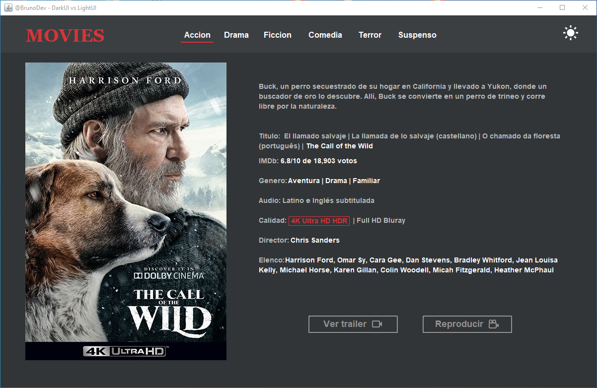

# Design-Java-Dark-UI-vs-Light-UI

Acercar de:
@author @BrunoDev, Bruno Beltre Guzman
GitHub: https://github.com/BrunoBeltreGuzman

Descripción: 
Programa en java que, con base de datos Microsoft Access, 
usando el jdbc ucanaccess de java, es un programa con experiencia de usuario, 
que contiene interfaz oscura y clara configurable con las preferencias del usuario.

Instrucciones: 
Copie y pegue la Base de Datos "BDUI" en el disco local C (C:/), 
Para poder guardar las preferencias del usuario

